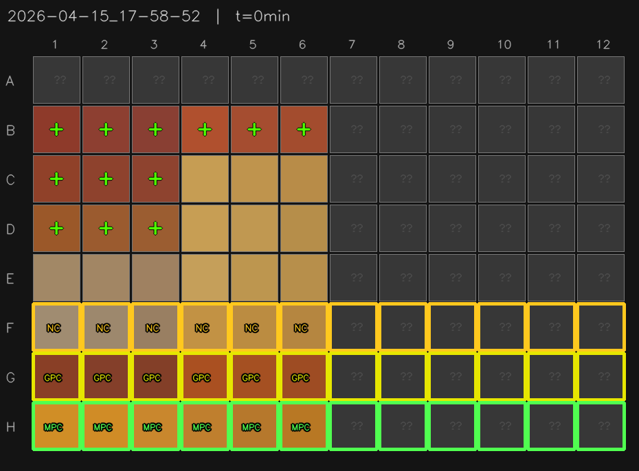
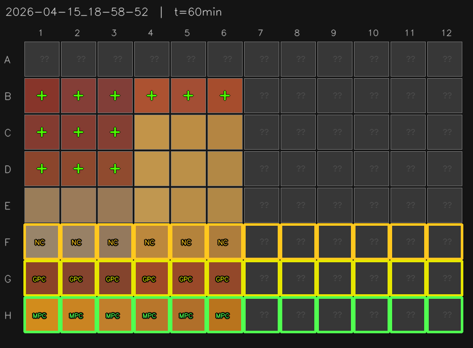
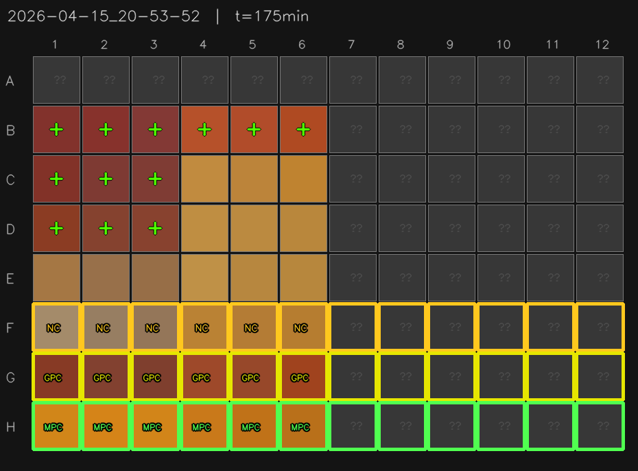

# Spot Assay — Automated 96-Well Plate Color Analysis

Automated pipeline for time-lapse color analysis of 96-well plate spot assays.  
A Raspberry Pi camera captures the plate every few minutes; images are uploaded to Firebase Storage and the cloud pipeline runs YOLO well detection, Delta-E color scoring, and produces annotated grids and a summary CSV — all without any on-premise compute.

---

## How it works

```
Raspberry Pi camera
        │ upload image
        ▼
Firebase Storage  (GCS)
        │ object.finalized event
        ▼
Eventarc → Cloud Function (event router)
        │ upsert Firestore state
        │ create Cloud Task (burst-collapsed, 2-min quiet period)
        ▼
Cloud Tasks → Cloud Run (analysis service)
        │ download all images for test
        │ run spot-assay pipeline
        │ upload results to GCS
        ▼
Firebase Storage  results/
  ├── well_colors.csv        ← per-well Delta-E scores, all timepoints
  ├── latest_summary.png     ← annotated grid of the final timepoint
  └── plate_grids/           ← per-image annotated grids
```

Multiple uploads within the same 2-minute window collapse into a single analysis run (Cloud Tasks deduplication by task name).  
If new images arrive while analysis is running, a catch-up task is automatically queued.

---

## Pipeline stages

### 1. Well detection — YOLO
A YOLOv8n model fine-tuned on 96-well plates detects and localises every well.  
Detected centres are snapped to a regularised 8×12 grid.

### 2. Color scoring — Delta-E
Each well's mean Lab color is compared against positive-control (PC) and negative-control (NC) references using CIE Delta-E 76.  
Score = 0 → identical to NC (no growth); Score = 1 → identical to PC (full growth).

### 3. Control row layout (defaults)

| Row | Role |
|-----|------|
| H   | Media positive control (MPC) |
| G   | Matrix positive control (GPC) |
| F   | Matrix negative control (NC) |

### 4. Output

**Annotated plate grid** — each well coloured by its measured Lab value; control rows outlined in green/yellow; positive wells marked `+`.

| t = 0 min | t = 60 min | t = 175 min |
|-----------|------------|-------------|
|  |  |  |

**Latest summary** (final timepoint):



**`well_colors.csv`** — columns: `timepoint_min`, `row`, `col`, `L`, `a`, `b`, `delta_e_pc`, `delta_e_nc`, `score`, `call`.

---

## Repository layout

```
tools/
  spot_assay.py           # top-level pipeline: collect → detect → score → export
  yolo_color_pipeline.py  # per-plate YOLO inference + Lab extraction
  hough_grid_annotate.py  # grid regularisation + well annotation

cloud/
  event_router/           # Cloud Function Gen2 — Eventarc trigger
    main.py
    requirements.txt
  analysis_service/       # Cloud Run Flask service
    main.py
    requirements.txt
    Dockerfile
  seed_ignored_tests.py   # one-time script: seed pre-existing folders → Firestore

tests/
  test_pipeline.py        # 100% unit test coverage of tools/

weights/
  .gitkeep                # YOLO weights not tracked (download separately)
```

---

## Deployment

### Prerequisites
- GCP project with Firebase Storage (GCS), Firestore (native mode), Cloud Tasks, Cloud Run, Eventarc enabled
- Three service accounts (no hardcoded credentials in this repo — all passed as env vars):
  - **event-router** — runs the Cloud Function
  - **cloud-tasks-invoker** — OIDC token SA used by Cloud Tasks to call Cloud Run
  - **cloud-run-analysis** — runs the Cloud Run service

### Environment variables

**Cloud Function (`event_router/main.py`)**

| Variable | Description |
|----------|-------------|
| `GCP_PROJECT` | GCP project ID |
| `QUEUE_LOCATION` | Cloud Tasks queue region |
| `QUEUE_ID` | Cloud Tasks queue name |
| `CLOUD_RUN_URL` | Full HTTPS URL of the `/analyze` endpoint |
| `CLOUD_RUN_SA_EMAIL` | SA email used for OIDC on Cloud Tasks |
| `FIRESTORE_DB` | Firestore database name (default: `plate-analysis`) |
| `QUIET_PERIOD_SECS` | Burst-collapse window in seconds (default: `120`) |

**Cloud Run (`analysis_service/main.py`)**

| Variable | Description |
|----------|-------------|
| `GCS_BUCKET` | Firebase Storage bucket name |
| `GCP_PROJECT` | GCP project ID |
| `QUEUE_LOCATION` | Cloud Tasks queue region |
| `QUEUE_ID` | Cloud Tasks queue name |
| `CLOUD_RUN_URL` | This service's own `/analyze` URL (for self-requeue) |
| `CLOUD_RUN_SA_EMAIL` | SA email for OIDC on catch-up tasks |
| `FIRESTORE_DB` | Firestore database name (default: `plate-analysis`) |
| `WEIGHTS_PATH` | Path to YOLO weights inside container (default: `/app/weights/yolo_well_best.pt`) |
| `QUIET_PERIOD_SECS` | Must match event router value (default: `120`) |

### Build & deploy Cloud Run

```bash
# Build image (Dockerfile copies tools/ and weights/)
gcloud builds submit --config=cloudbuild.yaml .

# Deploy
gcloud run deploy analysis-service \
  --image=REGION-docker.pkg.dev/PROJECT/REPO/analysis-service:latest \
  --region=REGION \
  --set-env-vars="GCS_BUCKET=...,GCP_PROJECT=...,..."
```

### Deploy Cloud Function

```bash
gcloud functions deploy on_image_finalized \
  --gen2 \
  --runtime=python312 \
  --region=REGION \
  --source=cloud/event_router \
  --entry-point=on_image_finalized \
  --trigger-event-filters="type=google.cloud.storage.object.v1.finalized" \
  --trigger-event-filters="bucket=YOUR_BUCKET" \
  --trigger-location=us \
  --service-account=EVENT_ROUTER_SA \
  --set-env-vars="GCP_PROJECT=...,QUEUE_LOCATION=...,..."
```

### Seed ignored tests (run once before first deployment)

```bash
export GCS_BUCKET=your-bucket
export GCP_PROJECT=your-project
python cloud/seed_ignored_tests.py
```

---

## Running tests

```bash
pip install pytest pytest-cov ultralytics opencv-python-headless scipy numpy
pytest tests/ --cov=tools --cov-report=term-missing
```

100% statement coverage across `tools/`.
